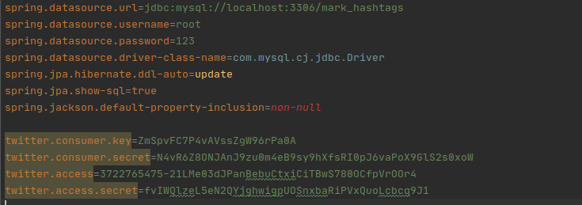
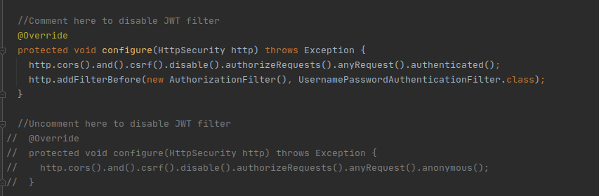

<h1 align="center">Welcome to Back-End from Mark Hashtags Project 👋</h1>

>This project is an internship challenge from [Magrathea Labs](https://magrathealabs.com). The challenge consists in to build a web application that's allows to mark twitter hashtags and collect tweets and retweets with it. Is also possible remove the marked hashtags. After collect, the app should to show the tweets as a list by hashtag on front-end.

## The back-end repository

- On this repository you will find:

    - A RESTful API with Java SpringBoot
    - The most common mapping REST requests, as DELETE, GET and POST  
    - The pattern SpringBoot Web Security
    - Authentication with Twitter OAuth and JWT Token
***

## Useful links
- [Front-end Repository](https://github.com/JJMoraes/mark_hashtags-front.git)
- [Magrathea Labs](https://magrathealabs.com)

***

## Install the Project

``` git clone https://github.com/JJMoraes/mark_hashtags-back.git ```

### Basics configs 

> You need to edit applications properties, as below



> Note that, you will need a twitter [developer account](https://developer.twitter.com/enhttps://developer.twitter.com/en) and create a twitter app at standard v1.1 API.
> After that, you need to set the Database configurations url, user and password and the keys from your twitter app. 

### Running using CLI

> First you'll need to install this external requirements

#### External Requirements
1. I'm using [Java 11](https://www.oracle.com/br/java/technologies/javase-jdk11-downloads.html).
2. I'm using Maven [3.6](https://maven.apache.org/download.cgi) too
3. I'm also are using [MySQL 5.7](https://dev.mysql.com/downloads/mysql/5.7.html)
4. If you want to run this project with an IDE we recommended that you install the plugins of lombok. There are in mostful Java IDE's like Eclipse, IntelliJ and VsCode.

#### Run Spring Boot

``` cd mark_hashtags_back ```

``` mvn spring-boot:run ```

#### Run tests

> Before running tests you will need to disable JWT filter on Security Config class

     

> To avoid unique constraints errors on save tests, make sure that your database tables are empty

### Run with Docker 

> First you'll need to install the [docker](https://docs.docker.com/engine/install/) +19.03 and [docker-compose](https://docs.docker.com/compose/install/) +1.17 

``` cd mark_hashtags_back ```

``` ./mvnw spring-boot:build-image -Dspring-boot.build-image.imageName=springio/gs-spring-boot-docker ```

``` docker-compose up --build ```

## Show your support ⭐️

Give a ⭐️ if this project helped you!
***